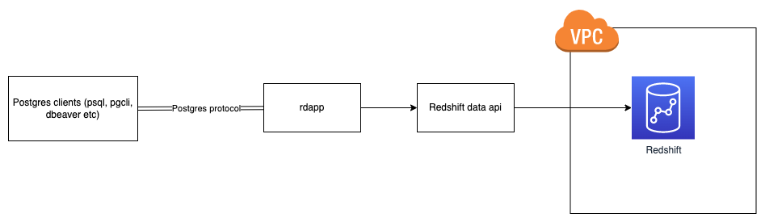

# rdapp - Redshift Data API Postgres Proxy

[](https://github.com/kishaningithub/rdapp/actions/workflows/build.yml)
[](https://pkg.go.dev/github.com/kishaningithub/rdapp)
[](https://goreportcard.com/report/github.com/kishaningithub/rdapp)
[](https://github.com/kishaningithub/rdapp/releases)
[](https://www.paypal.me/kishansh/15)

Use your favourite postgres tools to query redshift via the redshift data api.

## Table of contents

- [rdapp - Redshift Data API Postgres Proxy](#rdapp---redshift-data-api-postgres-proxy)
  - [Table of contents](#table-of-contents)
  - [Architecture](#architecture)
  - [Installation](#installation)
    - [Using Homebrew](#using-homebrew)
    - [Others](#others)
  - [Examples](#examples)
  - [Usage](#usage)
  - [Contributing](#contributing)
  - [Thanks](#thanks)

## Architecture



## Installation

### Using Homebrew

```bash
brew install kishaningithub/tap/rdapp
```

### Others

Head over to the [releases page](https://github.com/kishaningithub/rdapp/releases) and download a binary for your platform

## Examples

- Ensure aws credentials are setup in your env. Refer [aws cli configuration guide](https://docs.aws.amazon.com/cli/latest/userguide/cli-chap-configure.html)
  for more info.
- For proxying redshift serverless run command

```bash
$ rdapp --listen "127.0.0.1:15432" --database "<<db name>>" --workgroup-name "<<work group name>>" --secret-arn "<<secret arn>>"
```

- For proxying redshift provisioned run command

```bash
$ rdapp --listen "127.0.0.1:15432" --db-user <<db user>> --cluster-identifier "<<cluster identifier>>" --database "<<db name>>"
```

- If you notice above other than `--listen` which is the address rdapp listens to all other parameters are exactly the same
  as [aws cli's execute statement command](https://awscli.amazonaws.com/v2/documentation/api/latest/reference/redshift-data/execute-statement.html)
  this is intentional and will be maintained that way in the future. This also helps people who are currently using the cli
  to migrate to rdapp
- Once the proxy is up, use your favorite postgres tool to interact with your redshift database, the tool will connect to
  the address specified in the `--listen` and connects to it. If the parameter is not given it defaults to `127.0.0.1:25432`
  - My favourite pg tool being [pgcli](https://github.com/dbcli/pgcli) below is an example of using the same

```bash
$ pgcli -h localhost -p 15432
> select * from employee limit 1;
+-------+-----------+
| id    | name      |
|-------+-----------|
| 1     | john doe  |
+-------+-----------+
OK 1
```

## Usage

```bash
$ rdapp -h
Use your favourite postgres tools to query redshift via redshift data api

Usage:
  rdapp [flags]

Flags:
      --cluster-identifier string
      --database string
      --db-user string
  -h, --help                        help for rdapp
      --listen string                (default "127.0.0.1:25432")
      --secret-arn string
      --workgroup-name string
```

## Contributing

See [CONTRIBUTING.md](./CONTRIBUTING.md)

## Thanks

Special thanks to [@jeroenrinzema](https://github.com/jeroenrinzema) for creating [psql-wire](https://github.com/jeroenrinzema/psql-wire)
without which this project might not have been possible.
